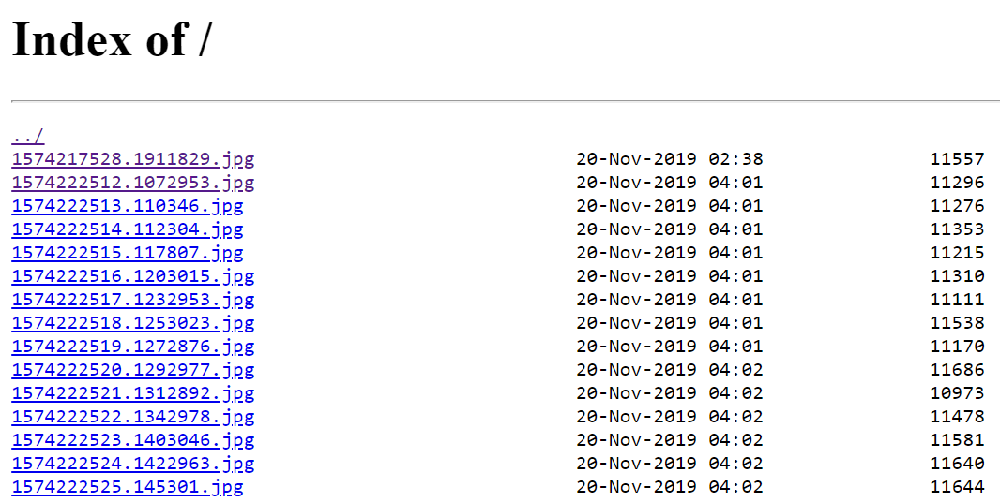

# Docker+Python+Nginx部署分享图片的应用

这是一个如何使用Docker打包自己的Python应用，同时利用Nginx进行部署的教程

简单设想一个应用：我们将当前的时间做成图片，部署到远程服务器上，别人通过IP地址进行访问查看我们的图片

## 做图片的代码：
```python
import cv2 as cv
import numpy as np
import time
import datetime

save_path = './time_imgs/'
while 1:
    img_array = np.zeros((300,600),dtype='uint8')
    text = str(datetime.datetime.now())
    font_face = cv.FONT_HERSHEY_PLAIN
    font_scale = 2
    thickness = 2

    text_size = cv.getTextSize(text,font_face,font_scale,thickness)

    origin_x = (img_array.shape[1] - text_size[0][0])//2
    origin_y = (img_array.shape[0] + text_size[0][1])//2

    cv.putText(img_array,text,(origin_x,origin_y),font_face,font_scale,(255,255,255),thickness,8,0)

    cv.imwrite(save_path+str(time.time())+'.jpg',img_array)

    time.sleep(1)
```
这样，每隔一秒，程序就将当前时间做成图片保存下来，效果如下：


## 上传应用代码
接下来我们需要将这个代码放在服务器上，工具很多，ssh命令，xshell软件，或者pycharm都可以
我上传后的目录结构：
```text
-Hi_Docker
---Project
------time_imgs
------gen_img.py
```

## 准备Dockerfile
Docker作为一个系统级的容器，权当它是让你重装了一个系统，流程就是下面这样
```text
# ---------------------------配置系统，添加加速源，更新源 ------------------------------------
FROM ubuntu:16.04 
LABEL maintainer "NVIDIA CORPORATION <cudatools@nvidia.com>"
RUN sed -i "s/archive.ubuntu./mirrors.aliyun./g" /etc/apt/sources.list
RUN sed -i "s/deb.debian.org/mirrors.aliyun.com/g" /etc/apt/sources.list
RUN sed -i "s/security.debian.org/mirrors.aliyun.com\/debian-security/g" /etc/apt/sources.list
RUN sed -i 's/archive.ubuntu.com/mirrors.ustc.edu.cn/g' /etc/apt/sources.list
RUN apt-get update
# -----------------------------------------------------------------------------------------

# ------------- 安装nginx ---------------
RUN  apt-get install -y nginx
# --------------------------------------

# ************** 更改nginx默认配置 ********
ADD ./default /etc/nginx/sites-available # 要事先准备：default文件
# ****************************************

# ------------------------------ 安装依赖，python，pip -----------
RUN apt-get update
RUN  apt-get upgrade -y
RUN  apt-get install -y libglib2.0-0
RUN  apt-get install -y libsm6
RUN  apt-get install -y libxrender1
RUN  apt-get install -y libxext-dev
RUN  apt-get install -y scrot
RUN  apt-get install -y python3
RUN apt-get install -y wget vim
RUN wget -O /tmp/get-pip.py https://bootstrap.pypa.io/get-pip.py
RUN python3 /tmp/get-pip.py
RUN pip3 install --upgrade pip
# ---------------------------------------------------------------

# ******************* 配置时区为上海 *********
ADD ./Shanghai /etc/                        # 要事先准备：Shanghai 时区文件
RUN mv /etc/Shanghai /etc/localtime
RUN echo 'Asia/Shanghai' >/etc/timezone
# ******************************************

# ************************ 安装项目使用到的库 *****************************
ADD ./requirements.txt /tmp/requirements.txt                            # 要事先准备：requirements文件
RUN pip3 install --default-timeout=1000  -i https://pypi.tuna.tsinghua.edu.cn/simple  -r /tmp/requirements.txt
# ***********************************************************************

# -------------------- 将整个项目文件放进Docker ------------
ADD ./Project /opt/Project
WORKDIR /opt/Project/
# --------------------------------------------------------

# ------ 声明端口 ------
EXPOSE 8080 # EXPOSE命令只是声明了容器应该打开的端口并没有实际上将它打开
# ---------------------

# ------- 运行nginx和主程序 -----------
CMD nohup sh -c '/usr/sbin/nginx && python3 gen_img.py'
# ------------------------------------
```
`Dockerfile`虽然写好了，但是也说了，欠缺三个文件：
+ `default`:nginx配置文件
+ `Shanghai`:时区文件
+ `requirements`:python外部库文件

### default
```text
##
# You should look at the following URL's in order to grasp a solid understanding
# of Nginx configuration files in order to fully unleash the power of Nginx.
# http://wiki.nginx.org/Pitfalls
# http://wiki.nginx.org/QuickStart
# http://wiki.nginx.org/Configuration
#
# Generally, you will want to move this file somewhere, and start with a clean
# file but keep this around for reference. Or just disable in sites-enabled.
#
# Please see /usr/share/doc/nginx-doc/examples/ for more detailed examples.
##

# Default server configuration
#
server {
	listen 80 default_server;
	listen [::]:80 default_server;

	# SSL configuration
	#
	# listen 443 ssl default_server;
	# listen [::]:443 ssl default_server;
	#
	# Note: You should disable gzip for SSL traffic.
	# See: https://bugs.debian.org/773332
	#
	# Read up on ssl_ciphers to ensure a secure configuration.
	# See: https://bugs.debian.org/765782
	#
	# Self signed certs generated by the ssl-cert package
	# Don't use them in a production server!
	#
	# include snippets/snakeoil.conf;
    
    # ************ 需要分享的文件夹 ****************
	root /opt/Project/time_imgs/;               #*
    # ********************************************
	autoindex on;

	# Add index.php to the list if you are using PHP
	index index.html index.htm index.nginx-debian.html;

	server_name _;

	location / {
		# First attempt to serve request as file, then
		# as directory, then fall back to displaying a 404.
		try_files $uri $uri/ =404;
	}

	# pass the PHP scripts to FastCGI server listening on 127.0.0.1:9000
	#
	#location ~ \.php$ {
	#	include snippets/fastcgi-php.conf;
	#
	#	# With php7.0-cgi alone:
	#	fastcgi_pass 127.0.0.1:9000;
	#	# With php7.0-fpm:
	#	fastcgi_pass unix:/run/php/php7.0-fpm.sock;
	#}

	# deny access to .htaccess files, if Apache's document root
	# concurs with nginx's one
	#
	#location ~ /\.ht {
	#	deny all;
	#}
}


# Virtual Host configuration for example.com
#
# You can move that to a different file under sites-available/ and symlink that
# to sites-enabled/ to enable it.
#
#server {
#	listen 80;
#	listen [::]:80;
#
#	server_name example.com;
#
#	root /opt/helmet_det_docker/images/;
#	index index.html;
#
#	location / {
#		try_files $uri $uri/ =404;
#	}
#}
```

### Shanghai
这个也可以不用，自行配置docker的时区也无妨
### requirements 
```shell script
pip freeze > requirements.txt
```

## 开始创建镜像
进入`Hi_Docker`
```shell script
docker build -t hello_docker . # -t 是tag简称
```
## 运行镜像
```shell script
docker run -v /root/ChenJian/Hi_Docker/rootimgs:/opt/Project/time_imgs -p 9999:80 hello_docker
```
为了说明命令这里新建了个文件夹`rootimgs`
+ -p: 指定端口映射，格式为：主机(宿主)端口:容器端口
+ -volume , -v: 绑定一个卷

浏览器访问：`xxx.xxx.xxx.xxx:9999
效果如下：


## 查看容器
```shell script
docker ps -a
```
## 进入容器
```shell script
docker exec -it 1133f6abaf51 /bin/bash
```
```shell script
root@1133f6abaf51:/opt/Project# 
```
## 关闭容器
```shell script
docker rm 1133f6abaf51 -f
```

